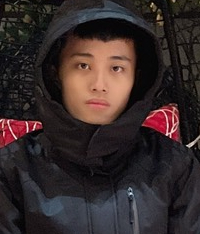

<h2 style="text-align: center">Machine Intelligence Laboratory (機器智慧實驗室)</h2>

<h2 style="text-align: center">Master students</h2>

姓名: 張敬賢

年級: 碩士班二年級

電子信箱: jim30425[at]gmail.com

研究興趣: 機器學習

 

 

姓名: 謝佩欣

年級: 碩士班二年級

電子信箱: student70226[at]gmail.com

研究興趣: 深度學習

 

 

<h2 style="text-align: center">Undergraduate students (Independent study)</h2>

姓名: 羅壹聘

年級: 資訊工程學系大學部三年級

電子信箱: yeepii1201[at]gmail.com

 

 

姓名: 王成志

年級: 資訊工程學系大學部三年級

電子信箱: qazwsxedc123789jkl[at]gmail.com

 

 

姓名: 黃偉誠

年級: 資訊工程學系大學部三年級

電子信箱: a0928778469[at]gmail.com

 

 

姓名: 黃梓豪

年級: 資訊工程學系大學部三年級

電子信箱: abc021789[at]gmail.com

 

 

姓名: 毛力毅

年級: 資訊工程學系大學部四年級

電子信箱: truck010101[at]gmail.com

研究興趣: 機器學習

 

 

姓名: 蔣昆興

年級: 資訊管理學系大學部四年級

電子信箱: neverleave0916[at]gmail.com

研究興趣: IoT, 深度學習

 

 

姓名: 黃教全

年級: 資訊工程學系大學部四年級

電子信箱: a3813065a[at]gmail.com

研究興趣: 深度學習

 

 

姓名: 林宥霖

年級: 資訊工程學系大學部四年級

電子信箱: sjisjisji0[at]gmail.com

研究興趣: 機器學習

 

 

<h2 style="text-align: center">Alumni</h2>

姓名: 蔡易澄

<!--年級: 資訊工程學系碩士班一年級-->

電子信箱: a0912053866a[at]gmail.com

研究興趣: 深度學習

 

 

姓名: 林桂梅

<!--年級: 大學部四年級-->

電子信箱: s9352816[at]gmail.com

研究興趣: 機器預測

 

 

 

姓名: 黃珮華

<!--年級: 大學部四年級-->

電子信箱: ilu6361972[at]gmail.com

研究興趣: 資料探勘

 

 

 

姓名: 歐宇哲

<!--年級: 大學部四年級-->

電子信箱: e96031001[at]gmail.com

研究興趣: 機器學習與預測分析

 

 

 

姓名: 陳品澔

<!--年級: 大學部四年級-->

電子信箱: hank85293[at]gmail.com

研究興趣: 機器學習

 

 

 

姓名: 張廷瑋

<!--年級: 碩士班一年級-->

電子信箱: willie20230[at]gmail.com

研究興趣: 深度學習

 

 

 

姓名: 呂明育

<!--年級: 碩士班一年級-->

電子信箱: mebius31111[at]gmail.com

研究興趣: 以深度學習為基礎,藉由圖像辨識來搜索物件

研究主題: 藉由圖像辨識的技術,來搜索農園裡的相關物件,建立一座智慧農園

 

 
