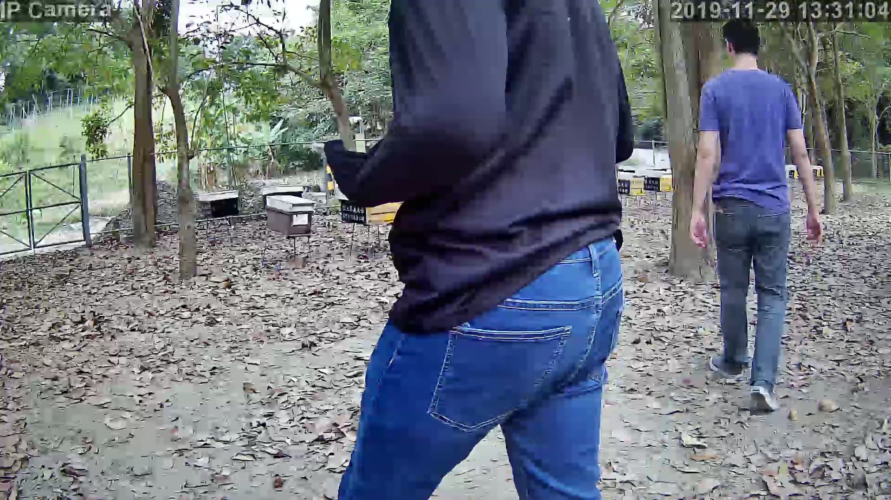

<h2 style="text-align: center">Research</h2>

<h2 style="text-align: center">2019 Porjects</h2>

<h3 style="text-align: left">Real-time broiler monitoring with YOLO-based detection techniques</h3>

* Description: In this work, a real-time YOLO-based broiler monitoring system was implemented and evaluated for use in a broiler house to detect broiler locations and to count the broilers. The experimental results show that the proposed monitoring system can successfully perform the broiler detection
and counting and it can draw the bounding boxes on the detected broilers and show the estimated count number on the screen.
* Collaborators:
  * Guei-Mei Lin
  * Pei-Hua Huang
* Publication:
  * Guei-Mei Lin, Pei-Hua Huang, Ching-Hsien Chao, Cheng-Ta Chiang, and Wen-Chieh Fang, "Real-time broiler monitoring with YOLO-based detection techniques," In Proceedings of the twenty-fourth Conference on Technologies and Applications of Artificial Intelligence (TAAI 2019), 2019.
 

<h3 style="text-align: left">Real-time Bee Farm Security/Warning System with ResNet techniques</h3>

* Description: In this study, we built up a real-time human detection system based on convolutional neural networks in the deep learning field for prevention of beehive burglar and enhancement of forest beekeeping security. We collected training image data from a traditional camera surveillance system installed in the experimental bee farm. Afterwards, the digital image data were linked to our human detection model from which we can establish the security system for prevention of beehive burglar within the forest. 
* Collaborators:
  * Pin-Hao Chen
  * Yu-Zhe Ou

